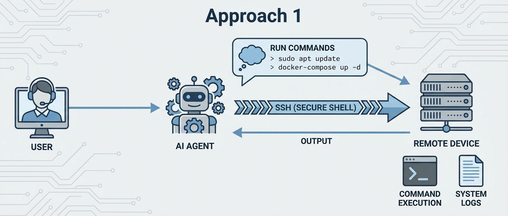
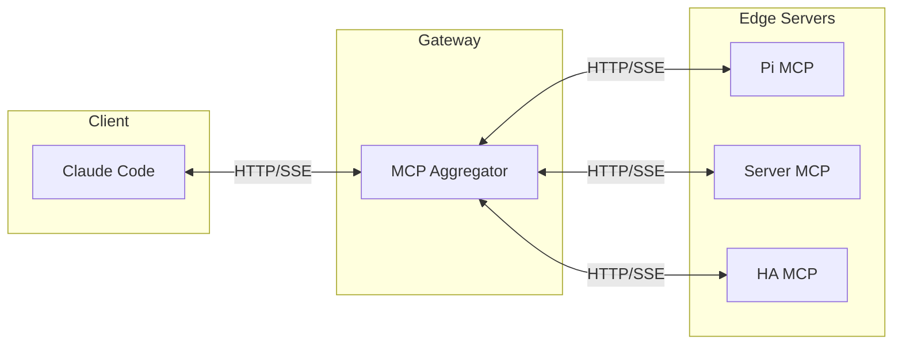
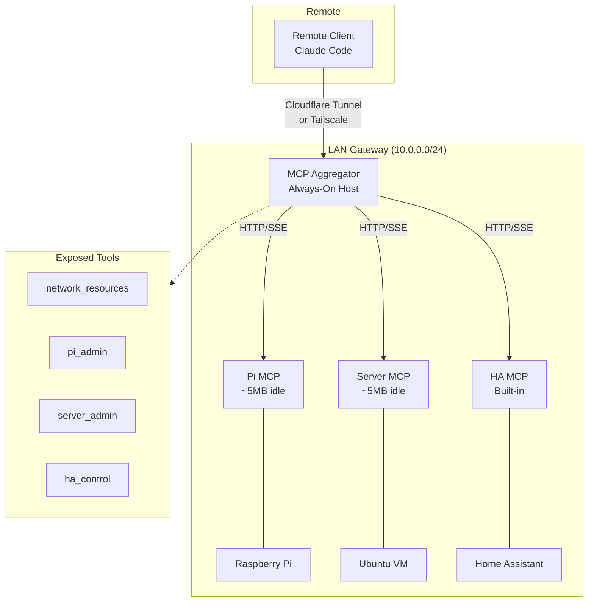
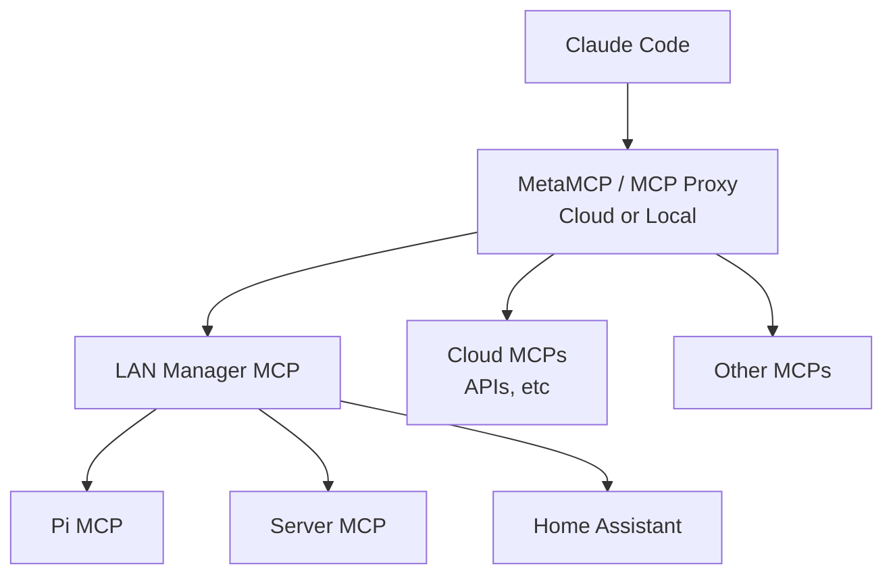
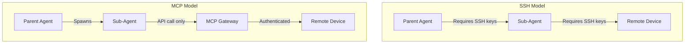

# MCP Network Manager Pattern

*25 Dec 2025*

*By Daniel Rosehill • [DSR Holdings](https://dsrholdings.cloud)*

A lightweight hub-and-spoke architecture for managing networked devices using MCP (Model Context Protocol) servers, enabling AI agents to administer entire networks from any authenticated client.

---

## 1. Overview

This document presents an architectural pattern for distributed system administration using minimal MCP servers deployed across network infrastructure. Rather than executing resource-intensive AI agents directly on constrained hardware, this approach positions lightweight MCP endpoints throughout the network, orchestrated from a central gateway.

MCP servers exhibit minimal resource consumption when idle (~5MB RAM) and process requests statelessly, making them particularly well-suited for resource-constrained devices such as Raspberry Pi units and single-board computers (SBCs).

---

## 2. Problem Statement

AI coding agents such as Claude Code demonstrate significant capability as general-purpose system administration tools. The combination of comprehensive Linux knowledge, strong reasoning capabilities, and robust tool-calling support enables AI agents to execute virtually any action on any computer system—whether local or remote.

However, resource-constrained devices (SBCs, Raspberry Pi units, embedded systems) present challenges for traditional remote administration approaches:

### Approach 1: SSH from Local Agent

- Agent executes locally, dispatching SSH commands to remote target
- SSH maintains persistent connections with associated overhead
- Functional, but exhibits latency and connection instability

### Approach 2: Agent Execution on Remote Device

- Agent memory consumption combined with SSH session overhead
- Rapidly exhausts available resources on constrained hardware
- Results in OOM termination and shell session failures

### Approach 3: MCP Server on Remote Device

- Agent executes locally with full system resources available
- Lightweight MCP server (~5MB idle) on remote target processes requests
- Stateless HTTP eliminates persistent connection overhead
- Device administration via structured tool invocations

This constitutes the core pattern. It may be deployed standalone for single-device administration, or scaled into the hub-and-spoke architecture detailed below for multi-device orchestration through an aggregator.

---

## 3. Background

During extensive use of Claude for local system administration tasks, several permutations of remote device management were evaluated for stability and performance:

- Local agent with SSH to remote targets
- Agent with dedicated SSH MCP tool integration
- Remote agent execution via SSH session

No approach demonstrated decisive superiority, and the local agent with SSH command dispatch remained the primary methodology.

While debugging a persistent touchscreen calibration issue on a Raspberry Pi, the question arose: could an alternative architecture resolve the stability issues encountered when the AI agent interacted with constrained hardware?

Claude proposed deploying a minimal MCP server on the target device. Initial skepticism regarding differentiation from SSH-based command dispatch was addressed through implementation.

Results:
- **Stable operation** — connections maintained without session failures
- **Improved performance** — measurably faster than SSH-based execution
- **Rapid resolution** — the calibration issue was debugged in under three minutes

### Multi-Device Orchestration Potential

AI agents demonstrate capability for task delegation to sub-agents, including parallel worker dispatch. MCP's lightweight transport layer suggests strong suitability for networked multi-device orchestration scenarios.

---

## 4. Architecture

### Design Principles

Critical infrastructure should not depend on hardware with variable availability (such as desktop workstations). The recommended deployment assumes an always-on host for the proxy/aggregator role—this may itself be a Raspberry Pi or similar low-power device.

### Local Architecture

For local network administration, the client maintains a single connection to the MCP aggregator endpoint, which exposes tools for all network resources:

### Remote Architecture

For remote access, a secure tunnel (Cloudflare Tunnel or Tailscale) exposes the LAN aggregator to external clients. The pattern supports extension through multiple aggregation layers—proxy chaining enables unified control of local and remote resources through a single client connection.

The LAN Manager MCP functions as an MCP server itself, enabling integration with higher-level aggregators (such as MetaMCP) alongside cloud-based MCP endpoints:

---

## 5. Technical Analysis

### HTTP vs SSH: Why Small Differences Matter

| Aspect | SSH Session | MCP HTTP Server |
|--------|-------------|-----------------|
| Connection Model | Persistent, stateful | Stateless requests |
| Terminal Allocation | Requires PTY | No PTY required |
| Process Model | Shell process maintained | Per-request processing |
| Output Handling | Buffered output | Complete response streams |
| Idle Memory | ~50-100MB | ~5MB |
| Constrained Hardware | Prone to failure | Graceful handling |

**Key differentiator**: State management. MCP servers reduce to near-idle resource consumption between requests. No agent processes execute on low-resource hardware—devices remain lightweight listeners until invoked.

### Context Efficiency

Structured tool invocations reduce token overhead compared to SSH command construction:

| SSH Approach | MCP Approach |
|--------------|--------------|
| Construct: `ssh user@host "cmd"` | Call: `pi_admin(command="cmd")` |
| Parse shell output, MOTD, prompts | Receive structured JSON response |
| Handle escaping, quoting, exit codes | Clean error semantics |
| Interpret stderr and connection errors | Typed error responses |

Reduced context expenditure on command construction and output parsing enables more efficient agent reasoning.

### Sub-Agent Compatibility

MCP decouples authentication from tool access—a critical consideration for multi-agent architectures:

- **SSH model**: Sub-agents require SSH key access (security concern) or parent must proxy all commands (bottleneck)
- **MCP model**: Gateway manages authentication; sub-agents require only API access to the MCP endpoint
- Tool exposure is declarative—precise control over available capabilities without distributing shell access

---

## 6. Implementation

### Design Principles

Minimize complexity across all components:
- MCP aggregator: Python (FastAPI/Starlette)
- Edge servers: Python (minimal dependencies)
- Tunnel layer: Lightweight proxy (Cloudflare Tunnel, Tailscale)

### Recommended Tool Exposure

- **network_resources**: Enumerate known hosts on the network
- **[device]_admin**: Execute commands against specific edge MCP endpoints

### Operational Considerations

- Deploy static IP addressing for reliability
- Maintain version control for all configurations
- Schedule periodic MCP server updates
- Implement appropriate authentication mechanisms

### Deployment Procedure

1. Inventory LAN devices for administration (e.g., Home Assistant, Ubuntu Server, Raspberry Pi)
2. Deploy minimal MCP servers on each target device
3. Configure the aggregator on an always-on host
4. Establish remote access (Cloudflare Tunnel or Tailscale)
5. Implement authentication on the aggregator endpoint

**Note**: Certain applications provide native MCP support (e.g., Home Assistant). This trend is expected to accelerate, simplifying deployment.

For reference implementation, see [pi-mini-mcp.py](pi-mini-mcp.py).

---

## 7. Reference Implementations

For aggregator development, the following projects provide suitable foundations:

| Project | Description | Use Case |
|---------|-------------|----------|
| **[mcp-proxy](https://github.com/sparfenyuk/mcp-proxy)** | Lightweight MCP proxy | stdio-to-SSE conversion |
| **[MetaMCP](https://github.com/anthropics/anthropic-cookbook)** | Multi-server aggregation | Mixed local/remote MCP management |
| **[FastMCP](https://github.com/jlowin/fastmcp)** | Pythonic MCP framework | Rapid aggregator development |
| **Custom FastAPI** | Starlette/FastAPI implementation | Maximum customization |

Edge servers on constrained devices typically require minimal implementation (~100 lines Python).

---

## Credits

Diagrams created with Nano Banana Pro.
