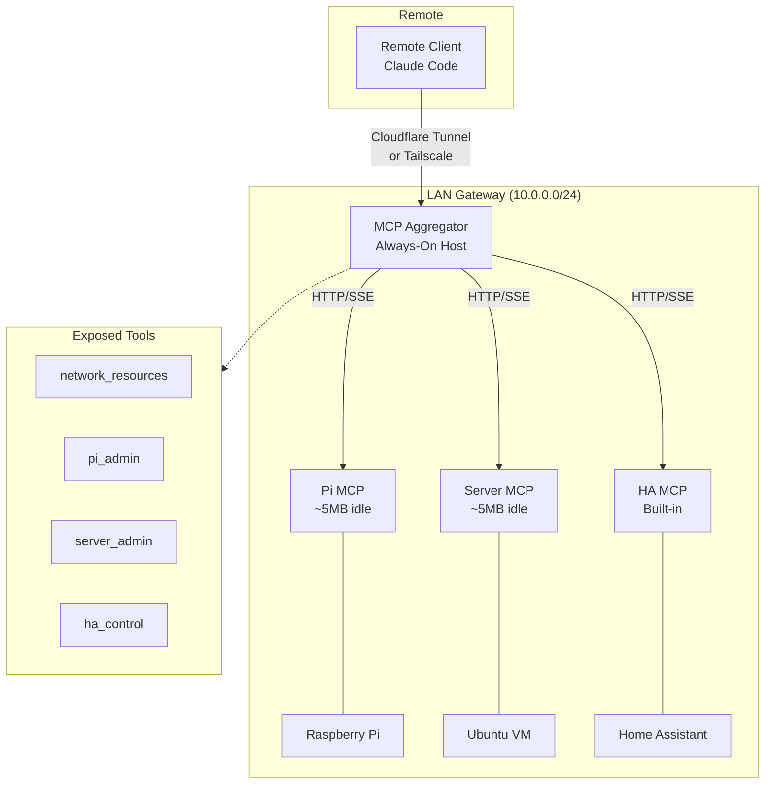
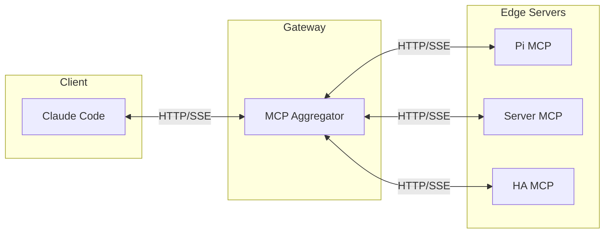
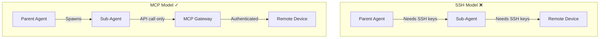
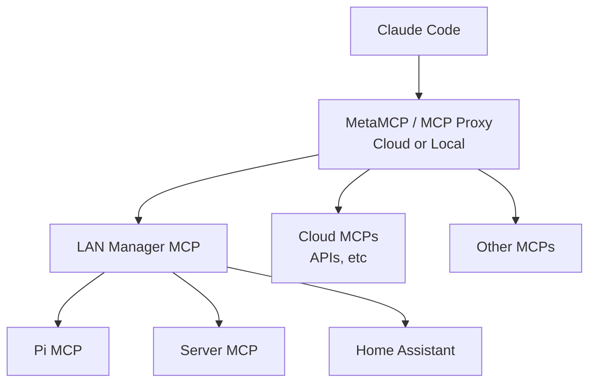

# MCP Network Manager Pattern

*24 Dec 2025*

A lightweight hub-and-spoke architecture for managing networked devices using MCP (Model Context Protocol) servers, enabling AI agents to administer entire networks from any authenticated client.

---

## Overview

This document describes a pattern for distributed system administration using minimal MCP servers deployed on network devices. Rather than running resource-heavy AI agents directly on constrained hardware, this approach positions lightweight MCP endpoints across the network, controlled from a central gateway.

MCP servers consume minimal resources when idle (~5MB) and handle requests statelessly, making them ideal for resource-constrained devices like Raspberry Pis and SBCs.

---

## The Problem

Claude Code and AI agents are massively underrated as general-purpose sysadmin tools. The combination of Linux knowledge, strong reasoning, and robust tool-calling support means AI agents can take virtually any action on any computer system—local or remote.

However, when working with resource-constrained devices (SBCs, Raspberry Pis, embedded systems), traditional approaches hit walls:

**Approach 1: SSH from local agent**

- Agent runs locally, SSHs commands to remote
- SSH maintains persistent connections with overhead
- Works, but can be slow and unstable

**Approach 2: Agent on remote device**

- Agent RAM usage + SSH overhead
- Grinds constrained hardware to a halt
- OOM kills and shell crashes mid-session

---

## The Discovery

Besides using Claude to fix all manner of things on my Linux desktop, I tried a few permutations of using Claude for local sysadmin—experimenting to see how each fared for stability and performance:

- Claude on local, SSH into remote (*"SSH into rpi and fix the Cloudflare tunnel"*)
- Claude + SSH MCP tool
- Claude on remote: SSH in and run it over the CLI (constraint: remote's hardware plus SSH; benefit: local environment)

It's hard to say whether one worked decisively better than the other, or what the differences amount to from a networking standpoint. So for the most part I stuck with the local + SSH approach (Claude running locally executes SSH commands to take actions on authenticated remotes).

While trying to debug a very stubborn touchpad calibration issue on a Raspberry Pi, I decided... why not ask Claude? I prompted something like:

> *"I've tried OOM, running Claude on the Pi and whatever we try the shell crashes halfway through our debugging session. Any bright ideas?"*

Claude suggested deploying a minimal MCP server on the Pi. I pushed back: how would that be different than SSHing commands to the machine? Claude pushed back with some explanation that remains above my pay grade. I figured it was worth a try.

To my surprise:
- **It worked** — stable connections without crashes
- **Significantly faster** than SSH-based execution
- The touchscreen calibration issue was debugged in 3 minutes!

### The Potential for Multi-Device Orchestration

Claude is great at delegating tasks to subagents and has even begun independently spinning off workers in parallel. The other day I prompted:

> *"Take down MPD on all the LAN devices and let's try LMS again."*

Claude dispatched agents (over SSH) and finished the job in a few minutes. If MCP provided the lightweight glue that made networked command execution lightning quick, this approach would probably work great with it!

---

## Architecture

### Design Principles

Wherever possible, avoid having critical infrastructure attached to hardware that's on and off (like a desktop). The deployment approach assumes you have an always-on computer to serve as the proxy/manager—that can itself be a Pi!

### Hub-and-Spoke Model

### Connection Pattern

The client connects to **one** MCP endpoint (the aggregator), which exposes tools for all network resources:

---

## Technical Benefits

### Why MCP Outperforms SSH for This Use Case

| Aspect | SSH Session | MCP HTTP Server |
|--------|-------------|-----------------|
| Connection | Persistent, maintained | Stateless requests |
| Terminal | Allocates PTY | No PTY needed |
| Process model | Shell stays alive | Process per request |
| Output handling | Buffers output | Streams complete |
| Idle overhead | ~50-100MB | ~5MB |
| Under load | Crashes on constrained hardware | Handles gracefully |

**The secret sauce**: State management. MCP servers drop to near-idle resource usage when not relaying data. No agents run on low-resource hardware—they remain lightweight listeners until called upon.

### Context Efficiency

Structured tool calls and responses reduce token overhead compared to SSH:

| SSH Approach | MCP Approach |
|--------------|--------------|
| Construct: `ssh user@host "cmd"` | Call: `pi_admin(command="cmd")` |
| Parse raw shell output, MOTD, prompts | Receive structured JSON response |
| Handle escaping, quoting, exit codes | Clean error semantics |
| Interpret stderr and connection errors | Typed error responses |

Less context spent on command construction and output parsing means more efficient agent reasoning.

### Sub-Agent Friendly

MCP decouples authentication from tool access, which is critical for multi-agent architectures:

- **SSH model**: Sub-agents need SSH key access (security risk) or parent must proxy all commands (bottleneck)
- **MCP model**: Gateway handles authentication; sub-agents only need API access to the MCP endpoint
- Tool exposure is declarative—control exactly what's available without distributing shell access

---

## Implementation

### Design Principles

Keep all moving parts as lightweight as possible:
- MCP aggregator in Python (FastAPI/Starlette)
- Edge servers in Python (minimal dependencies)
- Tunnel layer can be lightweight too

### Useful Tools to Expose

- **network_resources**: Lists known hosts on the network
- **[device]_admin**: Executes commands against specific edge MCPs

### Maintenance

- Use static IPs for reliability
- Version control all configurations
- Update MCP servers periodically
- Keep authentication tight

### Setup Pattern

1. Make a list of LAN devices to administer (e.g., Home Assistant at X, Ubuntu Server at Y, Raspberry Pi at Z)
2. Deploy minimal MCP servers on each target device
3. Set up the aggregator on an always-on host
4. Configure remote access (Cloudflare Tunnel or Tailscale)
5. Add authentication to the aggregator endpoint

**Note**: Some software already offers built-in MCP (like Home Assistant). Expect this to become more common—it simplifies setup significantly.

For an example edge server, see [pi-mini-mcp.py](pi-mini-mcp.py).

---

## Advanced: Proxy Chaining

The pattern can be extended with multiple aggregation layers:

Your LAN Manager MCP is itself an MCP server, so it can be added to any aggregator (like MetaMCP) alongside cloud-based MCPs. This allows unified control of local and remote resources through a single client connection.

---

## Suggested Aggregator Projects

If building your own aggregator, these projects provide useful foundations:

| Project | Description | Use Case |
|---------|-------------|----------|
| **[mcp-proxy](https://github.com/sparfenyuk/mcp-proxy)** | Lightweight MCP proxy | Simple stdio-to-SSE conversion |
| **[MetaMCP](https://github.com/anthropics/anthropic-cookbook)** | Aggregates multiple MCP servers | Managing mixed local/remote MCPs |
| **[FastMCP](https://github.com/jlowin/fastmcp)** | Pythonic MCP server framework | Building custom aggregators quickly |
| **Custom FastAPI** | Roll your own with Starlette/FastAPI | Maximum control and customization |

For edge servers on constrained devices, a minimal Python implementation (~100 lines) is often sufficient.

---

## Summary

This pattern enables:
- **Lightweight deployment**: ~5MB idle footprint per edge server
- **Centralized control**: One connection manages the entire network
- **Stability**: Stateless requests handle better than persistent SSH
- **Scalability**: Add devices by deploying minimal MCP servers
- **Flexibility**: Chain through proxies for complex topologies
- **Context efficiency**: Structured I/O reduces token overhead vs SSH command parsing
- **Sub-agent friendly**: Authentication at the gateway means no credential distribution to ephemeral agents
