# Example Deployment 1

## Example Usage

This deployment demonstrates how a **local MCP aggregator** can unify control over diverse network resources—combining OS-level controllers, application-specific MCPs, and generic endpoints into a single interface accessible by any AI tool.

> **Note:** This architecture is equally applicable to home networks, small businesses, enterprise environments, or any local network topology. The same aggregation pattern scales from a handful of devices to complex multi-site deployments.

Local MCP manager aggregates the following:

## Networked Endpoints (Generic / OS Controllers)

-  Local VM / home server
-  Proxmox (host level controller)
-  Raspberry Pi
-  Nano Pi x 3 (multiroom speakers, Lyrion)

## OS-Specific MCPs

- OPNsense for firewall management
- HAOS (Home Assistant)
- Synology MCP (NAS operations)

## Application Specific MCPs

- Network CUPS MCP for home printing

---

## Architecture Diagram

```mermaid
flowchart TB
    subgraph AI["AI Tools & Interfaces"]
        claude["Claude Code"]
        chatgpt["ChatGPT"]
        custom["Custom AI Agents"]
    end

    subgraph AGG["Local MCP Aggregator"]
        metamcp["MetaMCP / MCP Gateway"]
    end

    subgraph OS_MCP["OS-Level MCPs"]
        opnsense["OPNsense MCP<br/>(Firewall)"]
        haos["Home Assistant MCP<br/>(Smart Home)"]
        synology["Synology MCP<br/>(NAS)"]
        proxmox["Proxmox MCP<br/>(Virtualization)"]
    end

    subgraph APP_MCP["Application MCPs"]
        cups["CUPS MCP<br/>(Printing)"]
        lyrion["Lyrion MCP<br/>(Multi-room Audio)"]
    end

    subgraph ENDPOINTS["Generic Endpoints"]
        vm["Local VM"]
        rpi["Raspberry Pi"]
        nanopi["Nano Pi x3"]
    end

    AI --> AGG
    AGG --> OS_MCP
    AGG --> APP_MCP
    AGG --> ENDPOINTS

    opnsense -.-> fw[("🔥 Firewall<br/>10.0.0.1")]
    haos -.-> ha[("🏠 Home Assistant<br/>10.0.0.3")]
    synology -.-> nas[("💾 NAS<br/>10.0.0.50")]
    proxmox -.-> pve[("📦 Proxmox Host")]
    cups -.-> printer[("🖨️ Network Printers")]
    lyrion -.-> speakers[("🔊 Multi-room Speakers")]
```

---

## MCP Capability Matrix

| MCP | Status | Example Tools | Functionality |
|-----|--------|---------------|---------------|
| **Home Assistant OS** | ✅ Ready-Made (Built-in) | `HassTurnOn`, `HassTurnOff`, `HassLightSet`, `GetLiveContext` | Manage smart home devices, control lights, thermostats, locks, sensors; automate routines; query device states |
| **OPNsense** | 🔧 Needs Creation | `create_firewall_rule`, `list_interfaces`, `get_dhcp_leases`, `block_ip` | Firewall rule management, VPN configuration, DHCP/DNS management, traffic monitoring, intrusion detection |
| **Synology NAS** | 🔧 Needs Creation | `list_shares`, `create_snapshot`, `get_disk_health`, `manage_users` | File share management, backup operations, RAID health monitoring, user/permission management, package control |
| **Proxmox VE** | 🔧 Needs Creation | `list_vms`, `start_container`, `create_snapshot`, `migrate_vm` | Virtual machine lifecycle, container management, cluster operations, backup/restore, resource allocation |
| **CUPS (Printing)** | 🔧 Needs Creation | `list_printers`, `print_document`, `get_job_status`, `cancel_job` | Network printer discovery, print job management, queue monitoring, printer configuration |
| **Lyrion/LMS** | 🔧 Needs Creation | `play_music`, `set_volume`, `sync_players`, `browse_library` | Multi-room audio control, playlist management, player synchronization, music library browsing |
| **Raspberry Pi** | 🔧 Needs Creation | `run_command`, `read_file`, `get_system_status`, `gpio_control` | Remote shell execution, file operations, GPIO management, system monitoring |
| **Generic VM/Server** | 🔧 Needs Creation | `ssh_execute`, `file_transfer`, `service_status`, `resource_usage` | Remote administration, service management, log retrieval, health checks |

---

## Key Benefits of Unified MCP Aggregation

1. **Single Interface**: Any MCP-compatible AI tool gains access to all network resources through one connection point
2. **Consistent Authentication**: Centralized credential management across diverse systems
3. **Cross-System Automation**: Enable workflows that span multiple devices (e.g., "If motion detected, turn on lights AND pause music")
4. **Portable Architecture**: The same pattern works for home labs, SMBs, or enterprise networks
5. **Vendor Agnostic**: Mix and match hardware/software from different vendors under unified control